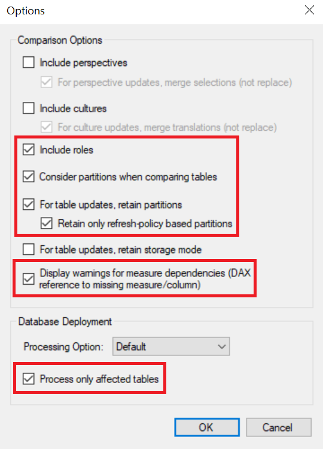

# ALM Toolkit In An Hour 

### About:
ALM Toolkit is a free and open-source tool to manage Microsoft Power BI datasets including the actions database compare, code merging, source-control integration, reusing definitions and self-service to corporate BI deployments.

In readiness for [XMLA endpoint read/write](https://docs.microsoft.com/en-us/power-platform-release-plan/2020wave1/business-intelligence/xmla-readwrite), objects specific to Power BI are also supported:
- Incremental refresh policies/partitions
- Aggregations
- Table level storage for composite models

Website: http://alm-toolkit.com/
___

**Follow Along:**
- [Download and Install ALM Tookit](http://alm-toolkit.com/)
    - <a href="" target="_blank">Optional: Guided Video</a>
- [Download and open the Sales Demo PBIX File](https://github.com/itsnotaboutthecell/Power-BI-Sessions/raw/master/ALM%20Toolkit%20In%20An%20Hour/Sales%20Demo.pbix)
- [Download the Sales Demo PBIT File]()

___

# Table of Contents
- [Tabular Object Model Hierarchy](#tabular-object-model-hierarchy)
- [Setup](#setup)
- [Comparison](#comparison)

___

# Tabular Object Model Hierarchy
**Source:** Microsoft Docs

The Tabular Object Model (TOM) exposes native tabular metadata, such as model, tables, columns, and relationships objects. A high-level view of the object model tree, provided below, illustrates how the component parts are related.

From a logical perspective, all tabular objects form a tree, the root of which is a Model, descended from Database. Server and Database are not considered tabular because these objects can also represent a multidimensional database hosted on a server running in Multidimensional mode, or a tabular model at a lower compatibility level that does not use tabular metadata for object definitions.

## Instructions
### [Optional: Guided Video]()
1. Open the Sales Demo (PBIX) file, navigate to the **External Tools** ribbon in Power BI Desktop and select **ALM Toolkit**.

**Important Note:** The underlying **model.bim** file can now be incorporated into your CI/CD pipelines for deployments with Azure DevOps. To deploy changes directly to existing datasets published in the Power BI service, enabling the XMLA read/write endpoint in the capacity settings and Power BI Premium is required. Once changes have been made to a dataset published in the service using the XMLA end point, a PBIX file will no longer be able to be downloaded.

[Learn More About Data Modeling and Management Tools](https://docs.microsoft.com/en-us/power-bi/admin/service-premium-connect-tools#data-modeling-and-management-tools)

___

# Setup

## Instructions
### [Optional: Guided Video]()

### Power BI Desktop
1. Ensure the Power BI preview feature [Store datasets using enhanced metadata format](https://docs.microsoft.com/en-us/power-bi/connect-data/desktop-enhanced-dataset-metadata) is enabled.
2. Open ALM Toolkit, select Options and enable the following options:

### Processing Options

| Mode | Description |
| :--- | :-----|
| Recalc | Updates and recalculates hierarchies, relationships, and calculated columns. |
| Default | Detects the process state of database objects, and performs processing necessary to deliver unprocessed or partially processed objects to a fully processed state. Data for empty tables and partitions is loaded; hierarchies, calculated columns, and relationships are built or rebuilt (recalculated). |
| Do Not Process | Will copy metadata but won't perform processing. |
| Full | Processes a database and all the objects that it contains. <b>When Process Full is run for an object that has already been processed, Analysis Services drops all data in the object, and then processes the object.</b> This kind of processing is required when a structural change has been made to an object. This option requires the most resources. |

[Learn More About Processing Options](https://docs.microsoft.com/en-us/analysis-services/tabular-models/process-database-table-or-partition-analysis-services?view=asallproducts-allversions#bkmk_process_db)

___

# Comparison

Source
Target

### Supported Connections:
- Dataset
    - Analysis Services Database
        - SQL Server Analysis Services (SSAS)
        - Azure Analysis Services (AAS)
        - [Power BI Premium Dataset (via XMLA)](https://docs.microsoft.com/en-us/power-bi/admin/service-premium-connect-tools)
- Power BI Desktop (PBIX)
- File (Metdata Only)
    - Power BI Template File (PBIT)
    - Business Intelligence Model (BIM)

**Important Note:** The target model compatibility level must be greater than or equal to the compatibility level of the source
model.

## Instructions
### [Optional: Guided Video]()

### Power BI Desktop
1. Open the Sales Demo (PBIX) file, navigate to the External Tools ribbon in Power BI Desktop and select ALM Toolkit.

### ALM Toolkit
1. Within the Connections dialog box confirm the following and press **OK** when complete.
    1. **Source** is the Power BI Desktop file Sales Demo that is currently open.
    2. Within the **Target** select **File** and navigate to the downloaded **Sales Demo.pbit**

### Power BI Desktop
1. Navigate to File, Options and Settings, Options and the **CURRENT FILE** sections **Data Load** properties and disable **Auto date/time**.

### ALM Toolkit
1. Press Compare and confirm the following remain unchanged.
    1. **Source** is the Power BI Desktop file Sales Demo that is currently open.
    2. Within the **Target** select **File** and navigate to the downloaded **Sales Demo.pbit**
2. Navigate to the **Home** tab and select the **Select Actions** and the **Hide Skip Objects with Same Definition** option.
3. Select the row containing the Table object named **Calendar** to compare the differences.

# Actions

### Available Actions
Create
Update
Delete
